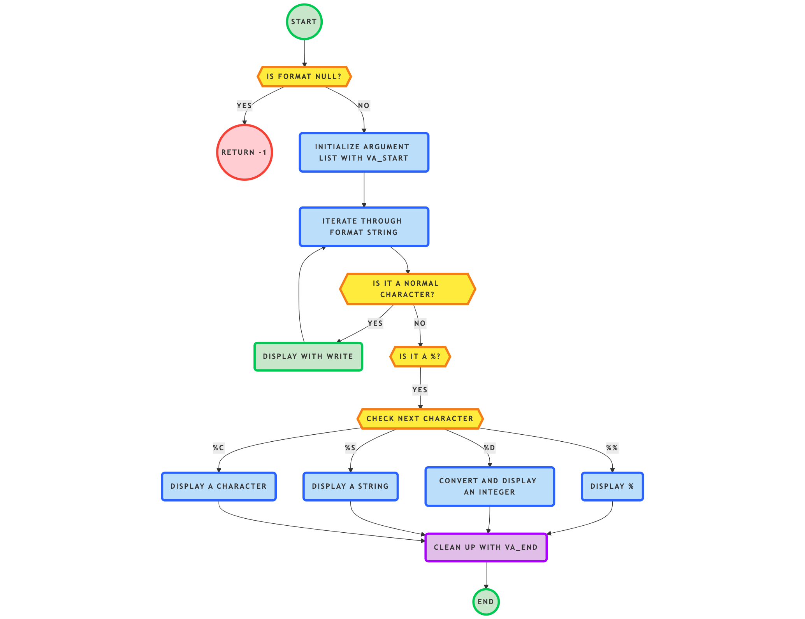

_printf

Description

_printf est une réimplémentation de la fonction standard printf en C. Cette fonction formate et imprime des données en fonction d'une chaîne de format spécifiée.

Fonctionnalités

Gère les conversions suivantes :

%c : Affiche un caractère

%s : Affiche une chaîne de caractères

%d / %i : Affiche un entier signé

%% : Affiche le caractère %

Utilise uniquement les fonctions autorisées (write, malloc, free, etc.).

Conforme aux normes de style Betty.

Compilation et Exécution

Compiler avec :

$ gcc -Wall -Werror -Wextra -pedantic -std=gnu89 -Wno-format *.c

Utilisation :

#include "main.h"

int main(void)
{
    _printf("Hello, %s!\n", "world");
    return (0);
}

Sortie :

Hello, world!

Exemples de sortie

_printf("Caractère: [%c]\n", 'H');
// Caractère: [H]

_printf("Chaîne: [%s]\n", "Holberton");
// Chaîne: [Holberton]

_printf("Nombre: [%d]\n", 98);
// Nombre: [98]

Man Page

Créer et afficher la page de manuel :

$ man ./man_3_printf

Normes de Code

Respecte les règles du style Betty (betty-style.pl, betty-doc.pl).

Pas de variables globales.

Maximum 5 fonctions par fichier.

Auteurs

stani78bks

boumy777

